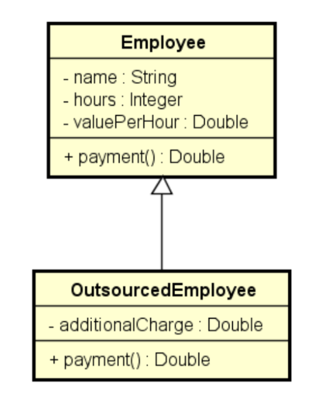
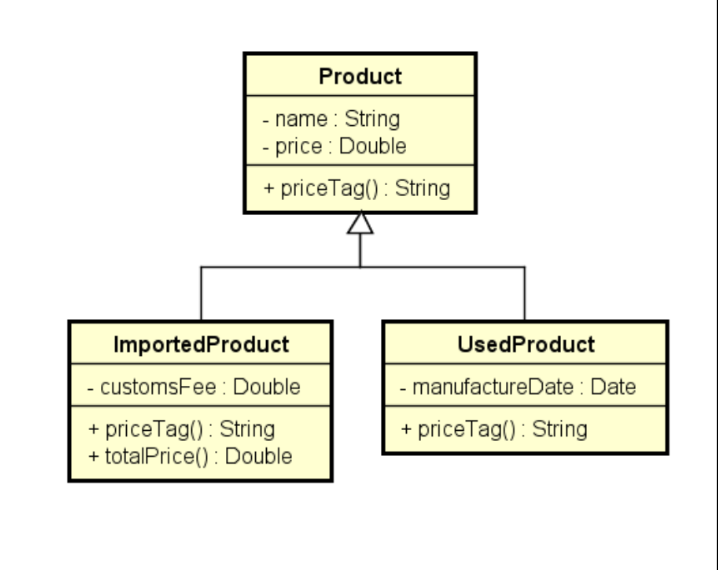
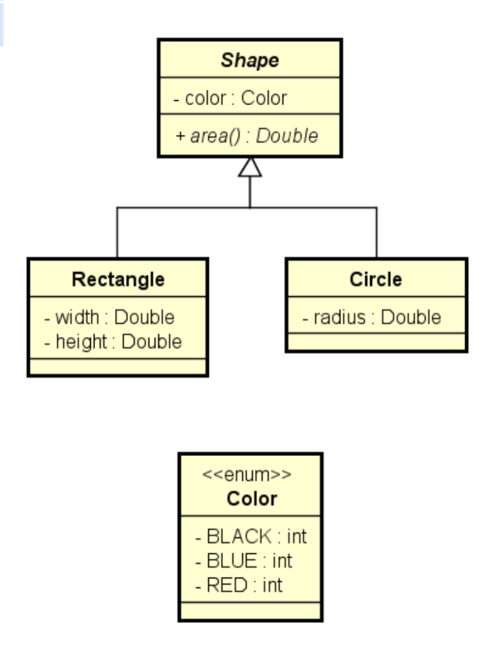

bb## Exercícios de fixação Herança e Polimorfismo

### Exercício 1

Uma empresa possui funcionários próprios e terceirizados. Para cada funcionário, deseja-se registrar nome, horas trabalhadas e valor por hora. Funcionários terceirizados possuem ainda uma despesa adicional.
O pagamento dos funcionários corresponde ao valor da hora multiplicado pelas horas trabalhadas, sendo que os funcionários terceirizados ainda recebem um bônus correspondente a 110% de sua despesa adicional.
Fazer um programa para ler os dados de N funcionários (N fornecido pelo usuário) e armazená-los em uma lista. Depois de ler todos os dados, mostrar nome e pagamento de cada funcionário na mesma ordem em que foram digitados.

### Exercício 2

Fazer um programa para ler os dados de N produtos (N fornecido pelo usuário). Ao final, mostrar a etiqueta de preço de cada produto na mesma ordem em que foram digitados.
Todo produto possui nome e preço. Produtos importados possuem uma taxa de alfândega, e produtos usados possuem data de fabricação.
Estes dados específicos devem ser acrescentados na etiqueta de preço conforme
exemplo (próxima página). Para produtos importados, a taxa e alfândega deve ser acrescentada ao preço final do produto.

### Exercício 3

Fazer um programa para ler os dados de N figuras (N fornecido pelo usuário), e depois mostrar as áreas destas figuras na mesma ordem em que foram digitadas.

### Exercício 4

Fazer um programa para ler os dados de N contribuintes (N fornecido pelo usuário), os quais podem ser pessoa física ou pessoa jurídica, e depois mostrar o valor do imposto pago por cada um, bem como o total de imposto arrecadado.
Os dados de pessoa física são: nome, renda anual e gastos com saúde. Os dados de pessoa jurídica são nome, renda anual e número de funcionários. As regras para cálculo de imposto são as seguintes:

**Pessoa física**:
- pessoas cuja renda foi abaixo de 20000.00 pagam 15% de imposto.
- Pessoas com renda de 20000.00 em diante pagam 25% de imposto.
Se a pessoa teve gastos com saúde, 50% destes gastos são abatidos no imposto.

> Exemplo: uma pessoa cuja renda foi 50000.00 e teve 2000.00 em gastos com saúde, o imposto fica:  
      (50000 *25%) - (2000* 50%) = 11500.00 
   

**Pessoa jurídica**:
- pessoas jurídicas pagam 16% de imposto. 
- Se a empresa possuir mais de 10 funcionários, ela paga 14% de imposto.
  
>Exemplo: uma empresa cuja renda foi 400000.00 e possui 25 funcionários, o imposto fica:
400000 * 14% = 56000.00
