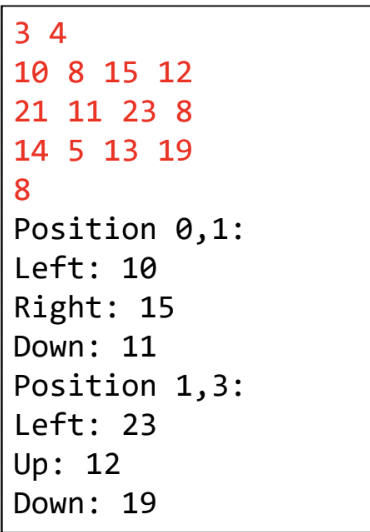

## Exercicíos de Fixação

### Exercicío 1
Fazer um programa para ler um número inteiro N e uma matriz de ordem N contendo número inteiros.
Em seguida, mostrar a diagonal principal e a quantidade de valores negativos da matriz.

### Exercicío 2
Fazer um programa para ler dois números inteiros M e N, e depois ler uma matriz de M linhas por N colunas contendo números inteiros, podendo haver repetições.
Em seguida, ler um número inteiro X que pertence à matriz. Para cada ocorrência de X, mostrar os valores à esquerda, acima, à direita e abaixo de X, quando houver, conforme exemplo.

